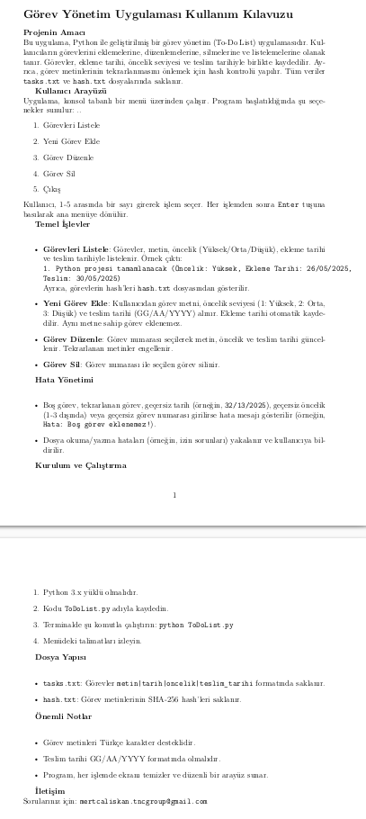
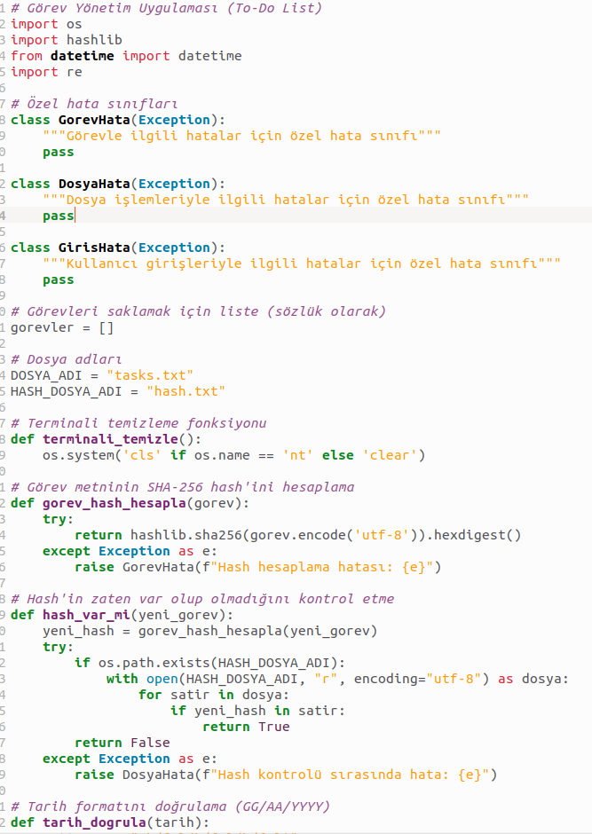
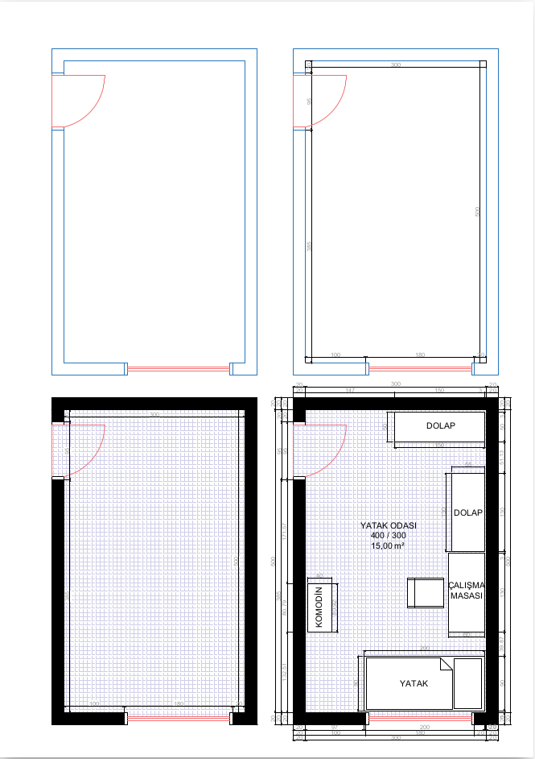

<h1 align="center">👋 Ömer Faruk Çelik</h1>

  <strong>Fizik + Bilgisayar Mühendisliği | Embedded Systems | AI/ML | IoT | Sualtı Haberleşme | Otonom Sistemler</strong>

  Gerçek dünya problemlerine hem fiziksel (donanım/sinyal işleme) hem algoritmik (AI/ML) çözümler üreten mühendis adayı.
   
  Teknofest · TÜBİTAK 2209-A · Turkcell YTLY Finalisti

---

## 🚀 Hakkımda

Merhaba! Ben **Ömer Faruk Çelik**, Fizik ve Bilgisayar Mühendisliği altyapısını birleştirerek;

- Sualtı haberleşme sistemleri  
- Gömülü yazılım ve mikrodenetleyici tabanlı projeler  
- Yapay zekâ ve görüntü işleme  
- PCB ve analog devre tasarımı  
- Otonom sistemler & ROS  

alanlarında projeler geliştiriyorum.

> Araştırma, geliştirme ve multidisipliner üretim odaklı ilerleyen bir mühendislik yolculuğundayım.

---

## 🚀 Uzmanlık Alanlarım

  
  
  
  
  
  

---

### 🔧 Teknik Yetenek Seviyeleri (Dinamik Bar)

| Alan | Seviye |
|------|--------|
| **Embedded Systems (STM32, ESP32, NRF52, Pixhawk)** | ████████████░░ 90% |
| **Görüntü İşleme & ML (CNN, TensorFlow, CV)** | ██████████░░░ 80% |
| **ROS / Gazebo / Otonom Sistemler** | █████████░░░░ 75% |
| **Analog Devre & PCB Tasarımı (KiCad, RF, Power Design)** | ████████░░░░░ 65% |
| **AI Destekli Otonom AUV / Sualtı Sistemleri** | ███████████░░ 85% |
| **Python / C / Robotik Yazılım** | ███████████░░ 85% |

---

### 💡 Odak Alanlarım
- Sualtı haberleşme sistemleri  
- Otonom sualtı/hava araçları (AUV / ROV / UAV)  
- Embedded sistem ve gerçek zamanlı yazılım  
- Yapay zekâ ile görüntü işleme  
- Sensör füzyonu ve otonom kontrol  
- Analog devre – güç elektroniği – PCB tasarımı  

## ⭐ Öne Çıkan Projeler

### 🔹 **Hibrit Sualtı Konumlandırma ve İletişim Sistemi**
**Turkcell YTLY & TÜBİTAK 2209-A**

Akustik dalga + skaler elektrik alanı ile hibrit modem tasarımı.

- Ag/AgCl elektrotlarla analog ölçüm  
- STM32 tabanlı sinyal işleme  
- Hamming & Gray Code hata düzeltme  
- Sensör füzyonu yaklaşımı  

📄 **PDF:** [Turkcell_YTL_Yarismasi_OmerFarukCelik.pdf](./Turkcell_YTL_Yarismasi_OmerFarukCelik.pdf)

---

### 🔹 **Teknofest ROV Görev Kontrol Sistemi**
ROS tabanlı görev planlama, sensör füzyonu, Pixhawk kontrolü.

📄 **PDF:** [ktr.pdf](./ktr.pdf)

---

### 🔹 **Staj Raporu – 50 Sayfa**
Sistem mühendisliği, embedded sistemler ve yazılım geliştirme deneyimleri.

📄 **PDF:** [Staj50SayfalikRapor.pdf](./Staj50SayfalikRapor.pdf)

---

### 🔹 **IP Hoparlör PCB Tasarımı**
IP tabanlı hoparlör devresi, PCB üretim dosyaları.

📄 **PDF:** [ipHoparlor_PCB.pdf](./ipHoparlor_PCB.pdf)

---

### 🔹 **Analog Devre & Güç Elektroniği Çalışmaları**
TDA2030 – LM386N-1 amplifikatör devreleri, analizler.

📄 **PDF:** [ktr.pdf](./ktr.pdf)

---

## 🧠 Teknik Yetkinlikler

### 💻 Programlama
Python · C/C++ · SQL · JavaScript · Flask

### 🤖 Yapay Zekâ / ML
CNN · TensorFlow · OpenCV · Veri analizi · Model eğitimi

### 🔌 Gömülü Sistemler
Raspberry Pi · STM32 · nRF52832 · Arduino · IR sensörler · BLE · LoRa · ZigBee

### ⚡ Elektronik
Analog devre tasarımı · PCB · Sinyal işleme · Ag/AgCl elektrot ölçümleri

### 🛠 Sistemler
Linux · ROS · Docker · Git · Gazebo

---

## 🎓 Eğitim

- **Fırat Üniversitesi — Bilgisayar Mühendisliği**  
- **Hacettepe Üniversitesi — Fizik Mühendisliği (Hazırlık + 2 yıl)**  

Teknofest Takımları • TÜBİTAK 2209-A • Turkcell YTLY Finalist

---

# 📁 PDF Portföy (Tüm Projeler)

Aşağıdaki PDF'ler portföyümün tamamını içermektedir:

| Proje / Rapor | PDF |
|--------------|------|
| Sualtı Haberleşme – Turkcell YTLY | [PDF](./Turkcell_YTL_Yarismasi_OmerFarukCelik.pdf) |
| 2209-A Proje Raporu | [PDF](./2209_A_OmerFarukCelik_son.pdf) |
| Staj Raporu | [PDF](./Staj50SayfalikRapor.pdf) |
| IP Hoparlör PCB | [PDF](./ipHoparlor_PCB.pdf) |
| Teknofest /Analog Devre Çalışmaları | [PDF](./ktr.pdf) |
| **Cilt Hastalığı Uygulaması** *(en güncel AI projem)* | 🔽 |

---

# 🩺 **CNN Tabanlı Cilt Hastalığı Tanı ve Öneri Uygulaması**

Mobil + AI destekli tanı modeli  
EfficientNet/EfficientDet eğitim dosyaları  
HAM10000 filtre analizleri  
Model karşılaştırmaları  

📄 **PDF (En Güncel Proje):**  
👉 [Cilt Hastalığı Tanı ve Öneri Uygulaması5.pdf](./Cilt%20Hastalığı%20Tanı%20ve%20Öneri%20Mobil%20Uygulaması5.pdf)

---
⭐ TNC Group Şirketleri Staj

🎓 1 Aylık Python · AutoCAD · Photoshop · Excel Eğitim & Uygulama Projeleri

 Bu bölüm TNC Group şirketleri bünyesinde tamamladığım staj süresince geliştirdiğim mini projeler, dokümanlar ve tasarımları içermektedir. Hem yazılım hem tasarım tarafındaki yetkinliklerimi gösteren küçük ama etkili örneklerdir. 
   <!-- CARD 1 --> 
 <h2>📘 Python Kullanma Kılavuzu</h2>     <a href="./PythonKullanmaKilavuzu.pdf" style="font-size:18px; font-weight:bold;">📄 PDF Dosyasını Aç</a> 
 <!-- CARD 2 --> 
 <h2>📝 Python To-Do List Uygulaması</h2>     <a href="./PythonToDoList.py" style="font-size:18px; font-weight:bold;">🧩 Kod Dosyasını Görüntüle</a> 
 <!-- CARD 3 --> 
 <h2>📊 Excel Tabanlı Profesyonel CV</h2>     <a href="./OmerFarukCelik.xlsx" style="font-size:18px; font-weight:bold;">📊 CV (XLSX) Dosyasını Aç</a> 
 <!-- CARD 4 --> 
 <h2>🎨 Photoshop Poster Tasarımı — Spiderman</h2>     <a href="./Spiderman.webp" style="font-size:18px; font-weight:bold;">🖼️ Poster Görselini Aç</a> 
 <!-- CARD 5 --> 
 <h2>📁 TNC Group Genel Portföy PDF</h2>     <a href="./OmerFarukCelik.pdf" style="font-size:18px; font-weight:bold;">📄 Genel PDF Portföyü Aç</a> 
 

## 📬 İletişim

📧 **E-posta:** faruktrhakan@hotmail.com  

🐙 **GitHub:** https://github.com/OmerFaruk-Celik/OmerFarukCelik/

🔗 **LinkedIn:** https://www.linkedin.com/in/%C3%B6mer-faruk-%C3%A7elik-270b1314b/

---

  ⭐ Fiziksel sistemler + algoritmik zekâyı birleştiren projeler üretmeyi seviyorum.
   Portföyümü inceleyebilir, projelerime göz atabilirsiniz!

